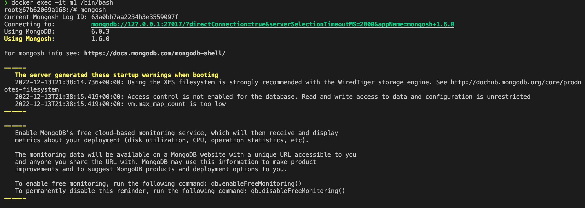
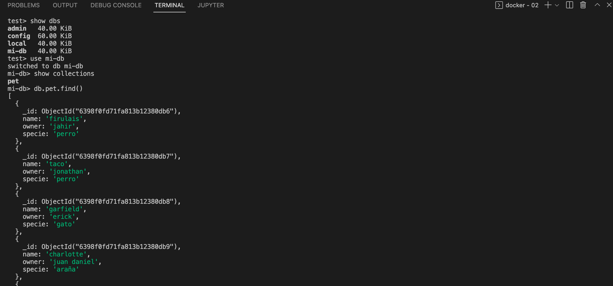

1. Arranque de mongo e ingreso por bash a la bd:

https://raw.githubusercontent.com/rdespitia70/exercises/02/resources/punto02-1.png

https://github.com/rdespitia70/docker-bootcamp-devops/blob/640f71bd43b3552b52b254496058649daac437cb/exercises/02/resources/punto02-1.png

