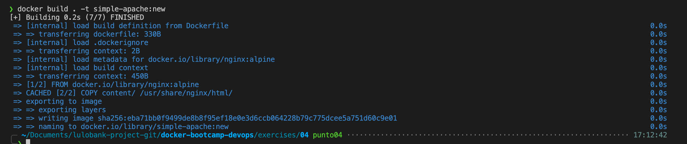
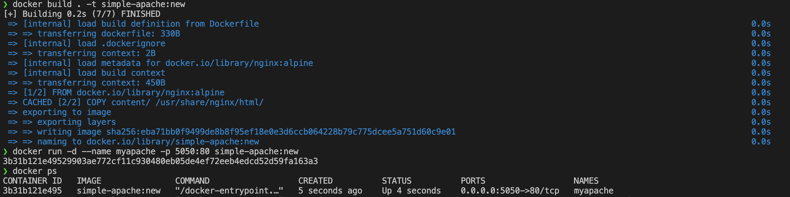
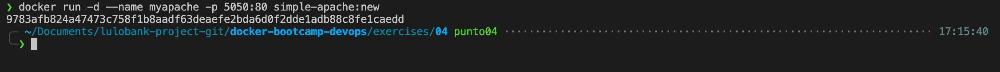
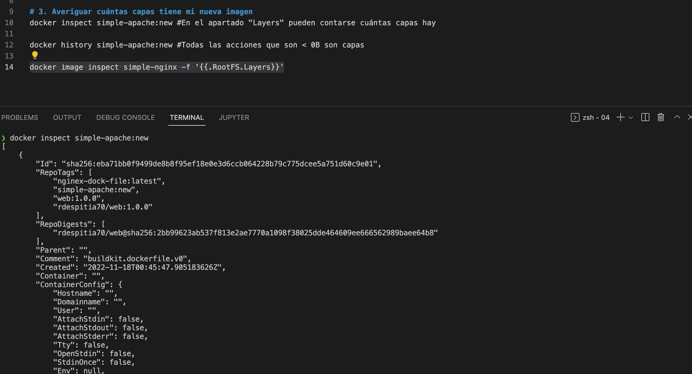

# 1. Crear una imagen con un servidor web Apache y el mismo contenido que en la carpeta content (fijate en el Dockerfile con el que cree simple-nginx)
docker build . -t simple-apache:new

# 2. Ejecutar un contenedor con mi nueva imagen
docker run -d --name myapache -p 5050:80 simple-apache:new

# 3. Averiguar cuntas capas tiene mi nueva imagen
docker inspect simple-apache:new #En el apartado "Layers" pueden contarse cuntas capas hay

docker history simple-apache:new #Todas las acciones que son < 0B son capas

