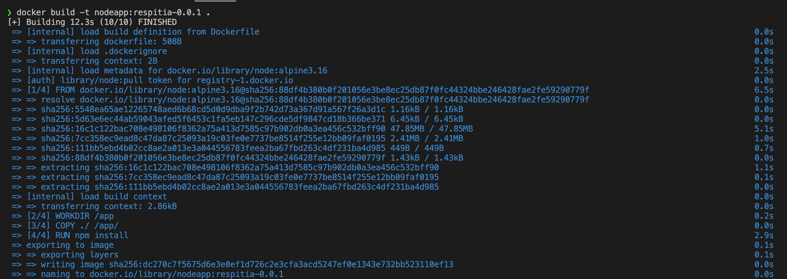
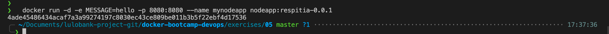
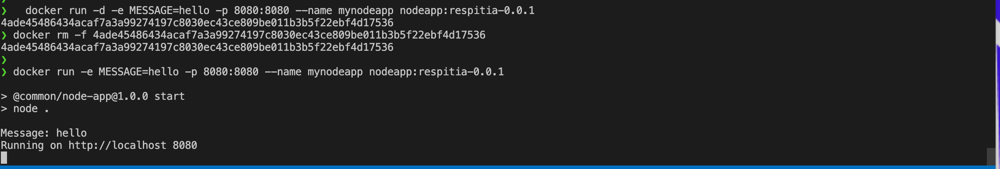
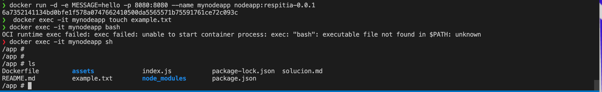

# 1. Construccion de la imagen

# 2. Arrancando el node en contenedor con la imagen anterior inyectando mensaje con la variable message

# 3. Generar archivo con el comando touch con docker exec

